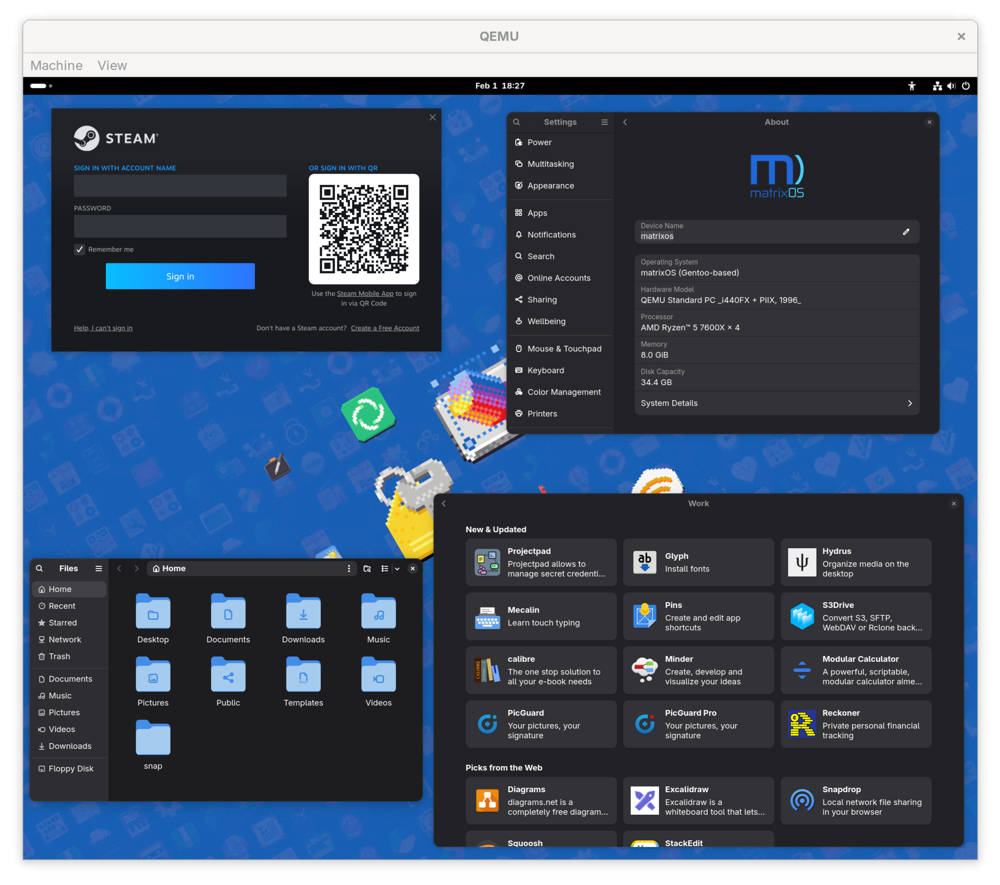
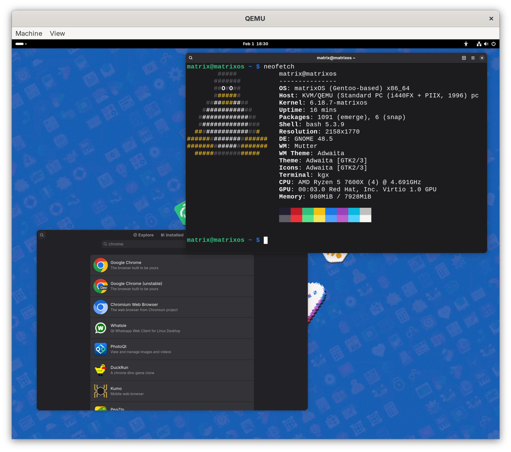
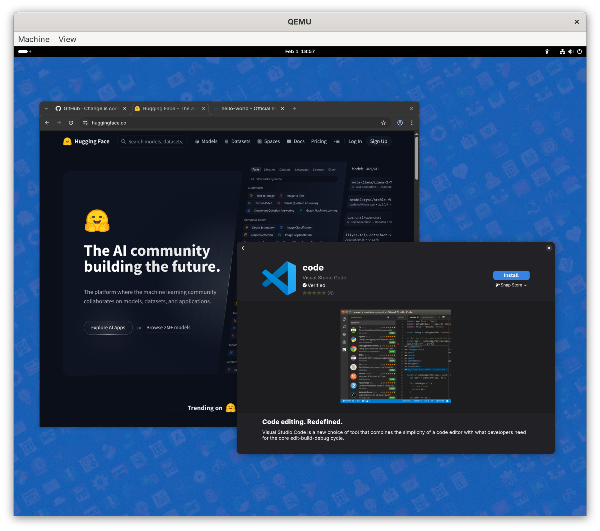

# 👋 Welcome to matrixOS

matrixOS is a Gentoo-based Linux distribution that blends the power and customizability of Gentoo with the reliability of OSTree atomic upgrades (yes bootc will come). It comes with Flatpak, Snap and Docker ready to go out of the box.

Our two main goals are:

- **Reliability**: Providing a stable, immutable base system through OSTree, which allows for atomic upgrades and rollbacks.
- **Gaming-Friendly**: Shipping with the Steam loader, Lutris and optimizations to get you gaming on both NVIDIA and AMD GPUs with minimal fuss.

<table align="center">
  <tr>
    <td align="center">
      <a href="./screenshots/1.png">
        
      </a>
      <br />
      <sub>GNOME Desktop w/Steam and GNOME Software</sub>
    </td>
    <td align="center">
      <a href="./screenshots/2.png">
        
      </a>
      <br />
      <sub>System/OS and Flatpak integration</sub>
    </td>
  </tr>
  <tr>
    <td align="center">
      <a href="./screenshots/3.png">
        
      </a>
      <br />
      <sub>OSTree integration</sub>
    </td>
    <td align="center">
      <a href="./screenshots/5.png">
        
      </a>
      <br />
      <sub>Coding and AI</sub>
    </td>
  </tr>
</table>

## ⚠️ Disclaimer

matrixOS distro images are coming on **2026-02-07** at the latest.

matrixOS is a hobby project created to maintain a personal homelab setup. It is **not** intended for production environments where reliability is paramount. While I can be my own SRE, I can't be yours. :-)

Everything in this repository is provided "AS IS" and comes with **NO WARRANTY**. Please see the License section for more details.

That said, you are encouraged to experiment! You can hack the configuration files and scripts to build your own fully functional, shiny Gentoo-based system for your VM, gaming rig, or minimal server.

As outlined below, one of the main goals in terms of backend stuff will be moving to bootc and Golang based wrappers around it. So, lots of the monstrous bash will be replaced with properly tested Golang code. For integration tests, I currently used the `dev/build.sh` script.

## 😎 Why matrixOS is Cool

matrixOS aims to bring you the latest and greatest from the Linux and open-source world—like the newest kernel, Wayland, and GNOME—while maintaining a remarkable level of stability.

We want gaming and Windows compatibility (via Proton/Wine) to work smoothly out of the box. However, matrixOS is not just for gaming. It serves as a lean base for any Flathub application and ships with Docker, allowing you to extend its capabilities without ever needing to touch the underlying Gentoo/Portage package system.

matrixOS is built on Gentoo, but you don't have to compile anything yourself unless you want to. You can  jailbreak from the immutable OSTree system and transform your install into a 100% compatible, traditional Gentoo system that you can customize and compile as you wish.

## ✨ Features

- Latest Mesa and NVIDIA drivers working out of the box.
- Includes `coolercontrold` and `liquidctl` for managing fans and liquid cooling.
- Ships with an `ntfsplus` filesystem driver.
- Supports UEFI SecureBoot with included certificates that are easy to install.
- Steam launcher, Flatpak, Snap and AppImage support are all available from first boot.
- Ships with `Google Antigravity` so you can vibe code too!
- No complex installer: just unpack (e.g. with `xz`) the image and `dd` the uncompressed file to an SSD or USB stick and you're good to go.
- Uses a `btrfs` filesystem on both `/boot` and `/` which automatically resizes to fill your drive on first boot.
- Zstandard (zstd) compression is enabled by default for btrfs filesystems, kernels, and modules for better performance.

## 💻 Requirements

matrixOS supports the x86_64/amd64 architecture and is compiled with `x86-64-v3` compiler flags. This means your CPU must support the following features:

- `AVX`, `AVX2`, `BMI1`, `BMI2`, `F16C`, `FMA`, `LZCNT`, `MOVBE`, `OSXSAVE`.

See this [Wikipedia x86-64 microarchitecture levels page](https://en.wikipedia.org/w/index.php?title=X86-64&section=20#Microarchitecture_levels) for more information.

You need a USB/SSD/NVME device of at least `24GB`, better if `32GB`.

## 💿 Installation

Just `dd` the image file to a USB or SSD/NVME drive of your choice. If the image is compressed, use the appropriate decompressor (e.g. `xz`). That's it. Alternatively, you can install matrixOS from a booted matrixOS system.

Example:

```shell
xz -dc matrixos_amd64_gnome-DATE.img.xz | sudo dd of=/dev/sdX bs=4M status=progress conv=sparse,sync
```

There are two users created by default on first boot:

- **root**: default password `matrix`
- **matrix** (UID=1000): default password `matrix`

If you chose the encrypted version, the default encryption password is: `MatrixOS2026Enc`.

The partitions and filesystem will be grown automatically on first boot to fill the remainder of the drive. Both `systemd-repart` and `systemd-growfs` are configured to expand the filesystem to the whole disk at boot. This process is a no-op on subsequent boots.

If you encounter issues, you can run the following commands.
> **Note:** The following commands must be run as root.

```shell
cryptsetup resize "/dev/disk/by-uuid/$(findmnt -n -o UUID /)"
btrfs filesystem resize max /
```

You can inspect the configuration in the `/etc/repart.d/` and `/etc/systemd/system/systemd-growfs-root.service.d/` directories. You are free to permanently disable this feature.

### Installing matrixOS from matrixOS

We need to go deeper! You can install matrixOS from a booted matrixOS system into another storage device, of course.

#### Install from a booted matrixOS system

> **Note:** The following command must be run as root.

```shell
/matrixos/install/install.device
```

Follow the instructions, and perhaps read the `--help`.

As you may have noticed, we are very strict in the expected partition layout. In fact, these are the partitions
that are required:

1. An ESP partition (partition type: `ef00` | GUID: `C12A7328-F81F-11D2-BA4B-00A0C93EC93B`).
1. A /boot partition (partition type: `ea00` | GUID: `BC13C2FF-59E6-4262-A352-B275FD6F7172`).
1. A / partition (partition type: `8304` | GUID: `4F68BCE3-E8CD-4DB1-96E7-FBCAF984B709`).

For encryption, the tooling supports only encryption of the `/` partition using cryptsetup-luks at the moment.

## ⚙️ Post-Installation

Please run the following script to set up your account credentials and LUKS passwords. It is very important to run this as root from a VT or the Desktop Environment; otherwise, the script will safely exit.

> **Note:** The following command must be run as root.

```shell
/matrixos/install/setupOS
reboot
```

### 🐳 How to use Docker

> **Note:** The following command must be run as root.

```shell
systemctl enable --now docker
```

Then follow the official documentation to install a Docker app. For example, see the [Portainer installation guide](https://docs.portainer.io/start/install-ce/server/docker/linux) to manage your containers through a web browser.

### 📝 How to add kernel arguments

matrixOS uses BLS config files stored in `/boot/loader/entries/`.

- In a **jailbroken** system (a standard Gentoo install), you can safely edit these files manually as OSTree is no longer in control.
- In a standard **matrixOS** system, these files are managed by OSTree. You should use `ostree` to modify kernel arguments.

> **Note:** The following command must be run as root.

```shell
# To add a kernel argument if it is missing (example: rootflags=discard=async)
ostree admin kargs edit-in-place --append-if-missing=rootflags=discard=async
```

The changes will be showing up in the `/boot/loader/entries/ostree-*.conf` files.

### 🔒 SecureBoot

matrixOS supports SecureBoot in two ways:

1. The image ships with a public certificate that you can enroll at first boot via the Shim MOK Manager.
2. To make things easier, matrixOS also ships with a MOK file (a DER binary format of the certificate) that you can enroll directly into `shim`. The `shim` is already signed with both the 2011 and 2023 Microsoft certificates.

### ⛓️ How to temporarily turn your matrixOS into a mutable system

It is possible to temporarily (until the next `ostree admin upgrade`), to enable mutability
without jailbreaking out of OSTreee.

> **Note:** The following command must be run as root.

```shell
ostree admin unlock --hotfix
```

Example output:

```shell
# ostree admin unlock --hotfix
Copying /etc changes: 48 modified, 1 removed, 135 added
Bootloader updated; bootconfig swap: yes; bootversion: boot.1.1, deployment count change: 0
Hotfix mode enabled.  A writable overlayfs is now mounted on /usr
for this booted deployment.  A non-hotfixed clone has been created
as the non-default rollback target.
```

### ⛓️ How to Jailbreak out of OSTree permanently

Jailbreaking allows you to convert your immutable matrixOS install into a traditional, mutable Gentoo system, forever.

1. **Run the post-installation setup.** See the Post-Installation section.

2. **Switch to the `-full` OSTree branch.** This branch contains the complete filesystem data and source code headers that are stripped from the default branch to save space.

    > **Note:** The following commands must be run as root.

    ```shell
    # Get the name of your current ostree branch (e.g., matrixos/amd64/dev/gnome)
    ostree admin status

    # Switch to the -full version of your current branch
    ostree admin switch <your-current-branch>-full
    reboot
    ```

    To see a full list of available branches on the main remote, run:

    > **Note:** The following command must be run as root.

    ```shell
    ostree remote refs origin
    ```

    If you are using your own local OSTree repository, run:
    > **Note:** The following command must be run as root.

    ```shell
    ostree --repo=/path/to/your/ostree/repo refs
    ```

3. **Run the jailbreak script.** This reconstructs the original filesystem structure, turning your installation into a full-blown Gentoo/Portage system.

    > **Note:** The following command must be run as root.

    ```shell
    /matrixos/install/jailbreak
    reboot
    ```

### How to upgrade to the latest matrixOS image

Note: this will be an area of development and improvement, because the current experience is very low-level. Albeit, the atomicity and immutability guarantees work well already.

> **Note:** The following command must be run as root.

```shell
ostree admin upgrade
reboot # the ostree:0 boot entry will be the latest image. ostree:1 will be the old one (rollback).
```

I am working on better CLI upgrade experience, you can find two nice wrappers here:

> **Note:** The following command must be run as root.

```shell
./install/upgrade
# alternative, on an installed system
/matrixos/install/upgrade
```

and a Golang based version (still WIP):

> **Note:** The following command must be run as root.

```shell
cd vector/
go run vector.go upgrade
```

### How to hop between matrixOS images with (almost no harm)

List the available remote branches:

```shell
ostree remote refs
```

Hop to a different one:

> **Note:** The following command must be run as root.

```shell
ostree admin switch <another_branch>
reboot
```

### How to roll back to the previous OSTree version

Just boot into the ostree:1 boot entry. Then pin ostree:1 if that works so that you don't lose it:

> **Note:** The following command must be run as root.

```shell
ostree admin pin 1
ostree admin status  # to show the new state.
reboot  # to see if the pinning worked.
```

## 🛠️ Build Your Own Distro

You can build your own custom version of matrixOS using the tools in this repository. The build, release, and image workflows can be run on any Linux-based system.

TL;DR: run `dev/build.sh` as `root`. Missing binaries will be highlighted there, missing dirs and such will be
prepared for you.

### Prerequisites

Before you begin, make sure you have the following:

1. **Basic Binaries**: The build scripts rely on common Linux utilities. You can check the `dev/check_environment_setup.sh` script to see what binaries are required.
2. **Private Configuration Repository**: You need a local clone of the configuration template available at [github.com/lxnay/matrixos-private-example.git](https://github.com/lxnay/matrixos-private-example.git). This repository contains sensitive information and configurations that should not be part of the public repository.

### Configuration

You can customize your matrixOS build by modifying files in several directories:

- `build/seeders/`: This directory contains the "seeders," which are the build layers of the OS. Each subdirectory (e.g., `00-bedrock`, `10-server`) represents a layer that is built sequentially. Inside each seeder, you'll find scripts and configuration files that define the packages and settings for that layer.

- `release/`: This directory contains configuration for the release process.
  - `release/hooks/`: Contains scripts that run at different stages of the release process to customize the final image.
  - `release/services/`: Allows you to define which systemd services are enabled, disabled, or masked.

    The directory structure for both `hooks/` and `services/` follows the pattern `OSNAME/ARCH/SEEDER_NAME`, where `SEEDER_NAME` is the name of the seeder without the numeric `XX-` prefix (e.g., `matrixos/amd64/gnome`). This lets you apply specific configurations to different release branches.

### The Build Workflow

The main build process is orchestrated by scripts in the `dev/` directory. The general workflow is **seeder -> release -> imager**.

1. **`build/seeder`**: Builds a seeder layer in a chroot environment.
2. **`release/release.seeds`**: Releases all the built seeds to an OSTree repository.
3. **`image/image.releases`**: Creates a bootable image from all the created releases, committing them to the local OSTree repository.

The `dev/build.sh` script automates this entire process. It is **very** important to keep in mind that
**if** you want to make changes to the build configs in `seeders/`, you **must** fork this repository,
and commit the changes there, then before launching `dev/build.sh`, you **must** export
`MATRIXOS_GIT_REPO=<url of your forked git repo>`. The build tool is going to warn you about this
whole thing. Example:

> **Note:** The following command must be run as root.

```shell
# ... fork this git repo
# ... clone the forked repo
# ... cd into your forked repo
# ... make the necessary changes, commit and push them!
export MATRIXOS_GIT_REPO=https://github.com/youruser/matrixos.git
./dev/build.sh
```

#### Resuming build

If the compilation for whatever reason, you can resume it via:

> **Note:** The following command must be run as root.

```shell
./dev/build.sh --resume-seeders
```

#### Resuming specific steps

If seeders complete but the release or image creation stops or you want to just force such steps, you can:

> **Note:** The following command must be run as root.

```shell
./dev/build.sh --force-release  # to force the releasers and imagers
./dev/build.sh --force-images   # to force the images
./dev/build.sh --only-images    # to only run the imager
```

#### Entering a seed chroot

If for whatever reason you need to enter the chroot of a to-be-built or built seeder, you can use the `enter.seed` script.

> **Note:** The following command must be run as root.

```shell
./dev/enter.seed out/seeder/chroots/<name>-<date>
# or just:
./dev/enter.seed <name>-<date>
```

#### Cleaning old artifacts

All the generated artifacts are in the `out/` and `ostree/` directories. You can just clean it up as you like. Careful that if something failed hard [OOMs] or something is running, you may remove data ported there via `--bind` mounts. For this reason, you can take a look at the in-active-development `dev/janitor` code (you need Golang) or at the `dev/clean_old_builds.sh` script. Eventually the `janitor` binary will be the only one orchestrating cleanups.

#### Resource requirements

- x86-64-v3 CPU
- 32+GB RAM
- 60-70GB of disk space

If your system OOMs (i.e. goes out of memory), note that the build flags in the `portage/` configs are
optimized for 32+GB of RAM machines, with a CPU cores/RAM ratio of 1/3, due to some naughty packages.

You may want to reduce the parallelism in `make.conf` or change the low memory configs in `portage.env`, or remove `sys-kernel/scx` from the build. Alternatively, locate the emerge flags setting functions (search for `nproc`) and change that snippet of code.

### 🌱 The Lifecycle of a matrixOS Image

Here is a high-level overview of the stages of development for a matrixOS image:

1. **Seeding**: A new build environment is created from a Gentoo stage3 tarball or an existing chroot.
2. **Build**: Packages are compiled and system services are configured.
3. **Release**: The built chroot is released to an OSTree repository.
4. **Imager**: A bootable image is created from the OSTree release.
5. **Flashing**: The image is written to a drive, either from a live environment or another Linux OS.
6. **Setup**: The end-user configures passwords, language, and other settings via `setupOS`.
7. **Fork in the road**:
    - Continue with the immutable, OSTree-based update model.
    - Jailbreak to a traditional, mutable Gentoo system.

## 🚀 Roadmap

The overall goal is to provide a user-friendly, immutable, A/B updatable, and 100% Gentoo-jailbreakable OS.

### Gaming

- Ship with ready-to-install Steam and other games.
- Provide state-of-the-art GPU support with the latest Linux kernel and GPU stack.

### Homelabbing

- Enable Docker/Flatpak-based workstation setups where everything above the core layer runs in containers.
- Serve as a bedrock for AI development and deployment.

### Reliability

- Ensure operational reliability by integrating with OSTree for immutability, verifiability, and atomic A/B upgrades.
- Create a user-friendly experience without letting the underlying tools get in the way.

### Infrastructure

- Evolve from a "bunch of shell scripts" to a fully automated CI/CD pipeline.
- Focus on "scaling ourselves out" to save time for implementing better user-facing experiences.

## 🎯 Roadmap Milestones

To achieve the goals in the Roadmap, the work is chunked into three milestones for v1.

- **Last completed**: `Milestone 1`.
- **Currently active**: `Milestone 3`.

### Milestone 1 (Focus: MVP)

- [x] Build a single workflow from a stage3 chroot to a bootable GNOME live image.
- [x] Make matrixOS bootable on x86-64-v3 hardware with SecureBoot integration.
- [x] Provide CLI tools for basic setup (localization, credentials, users).
- [x] Integrate Docker, Snap and Flatpak.
- [x] Ship a working gaming setup (Steam installer, GPU support).

### Milestone 2 (Focus: Infrastructure)

- [x] Automate the bootstrapping of a chroot environment from a stage3 tarball to create a Bedrock environment.
- [x] Build a well-themed, user-friendly GNOME environment off a Core layer.
- [x] Improve the post-install setup experience and fix bugs in `setupOS`.
- [x] Allow matrixOS to be installed from a live image using `image/` scripts that can target any pre-sized drive layout.

### Milestone 3 (Focus: User Friendliness)

- [ ] Integrate Hyprland as a desktop environment option.
- [x] Allow switching between OSTree branches to move between focus areas (e.g., Gaming to Workstation).
- [x] Battle-test and document OSTree rollbacks and roll-forwards.
- [x] Refine software selection, image sizes, and distribution of pre-built flavors.

### Milestone 4 (Focus: New Technologies)

- [ ] Heavily customize GNOME, introduce COSMIC Desktop and *maybe* KDE (if I will ever use it, probably not).
- [ ] Migrate to bootc + UKI, away from directly depending on ostree. Vector becomes a wrapper of bootc.
- [ ] Migrate to UKI instead of kernel image + initramfs.
- [ ] Migrate all code, except the most necessary filesystem bootstrapping code, to Golang and use
        GObject introspection or some other forms of bindings to minimize the use of bash.
- [ ] Write appropriate unit and integration tests and write proper CI/CD pipelining.

## Known issues

### Flatpak and Snap fight in GNOME Software

When I enable both, Snap takes over gnome-software, which misses a lot of cool apps compared to Flathub.
So, I decided last minute, until gnome-software can work with both at the same time, to disable Snap. However,
you can re-enable it at runtime with the following trick:

```shell
systemctl enable apparmor
systemctl enable snapd.apparmor
systemctl enable snapd
rm -rf ~/.cache/gnome-software  # remove this directory for every user affected
reboot  # just in case gnome-software has it's ETOOMUCHCACHING moments
```

### GNOME aspect ratio is either 100% or 200%

This is due to GNOME 48 not having this (to me) obvious feature of allowing you to select a finer grained
aspect ratio. This is allegedly fixed in GNOME 49, but for now, just do:

```shell
gsettings set org.gnome.mutter experimental-features "['scale-monitor-framebuffer']"
```

### NVIDIA drivers and nouveau fight

If somehow nouveau is being loaded and NVIDIA drivers are unable to, do this:

```shell
ostree admin kargs edit-in-place --append-if-missing=modprobe.blacklist=nouveau
ostree admin kargs edit-in-place --append-if-missing=rd.driver.blacklist=nouveau
```

## 🙏 Contributing

There are many ways you can contribute, whether with [time](#time), [resources](#resources), or [donations](#donations).

### Time

See the Roadmap section for what needs to be done. You can help by:

- Working on new features and sending pull requests.
- Improving CLI and GUI frontends for OSTree to make them more user-friendly (or help me move to bootc).
- Automating the CI/CD pipeline.
- Testing, reporting bugs, and fixing them.
- Contributing artwork.

### Resources

- **Mirrors**: We need mirrors (or even just bandwidth on a VPS) to help us distribute:
  - matrixOS Live images.
  - The OSTree repository.
  - Portage overlay distfiles.
- **Compute**: We need raw compute power to compile matrixOS. You can help by providing a VM or funding our server bills.

### Donations

- Donate to [Gentoo Linux](https://gentoo.org/donate).
- Review matrixOS on social media.
- Send us x86-64 hardware for our build servers.

## ❤️ Credits

- The Gentoo developers. Please consider donating to [gentoo.org](https://gentoo.org/donate).
- The author.
- The junior engineers that advise on every matter: Google Gemini AI agents.
- All the authors of commits in the matrixOS Git repositories.

## 📄 License

Each application distributed by matrixOS carries its own license, which you must respect.
For a list of licenses you are implicitly accepting, see `build/seeders/20-gnome/portage/package.license`.

All first-party code provided by matrixOS is released under the **BSD 2-Clause "Simplified" License**.
