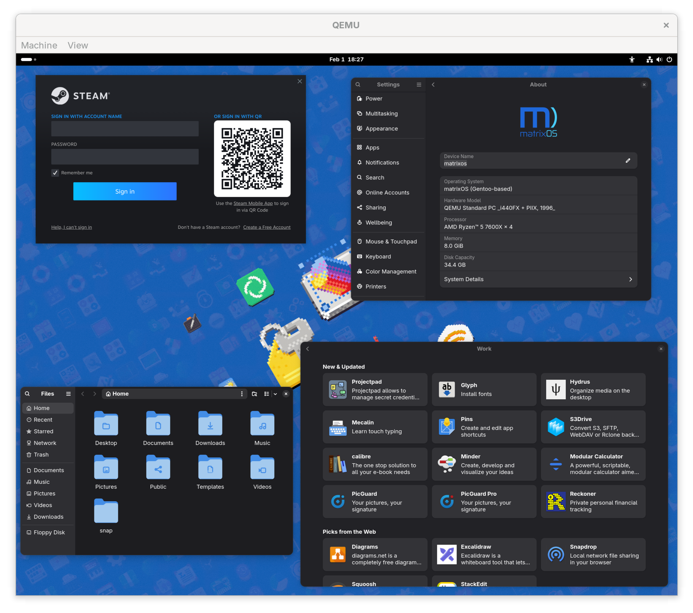
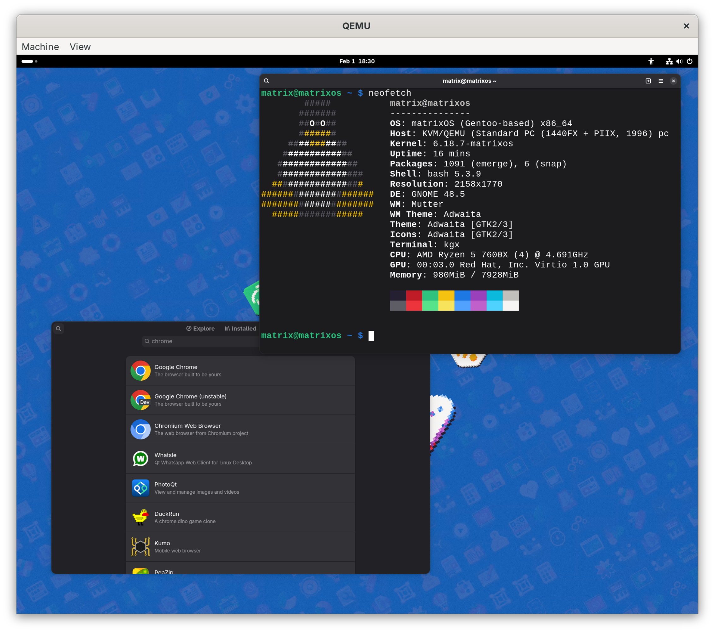
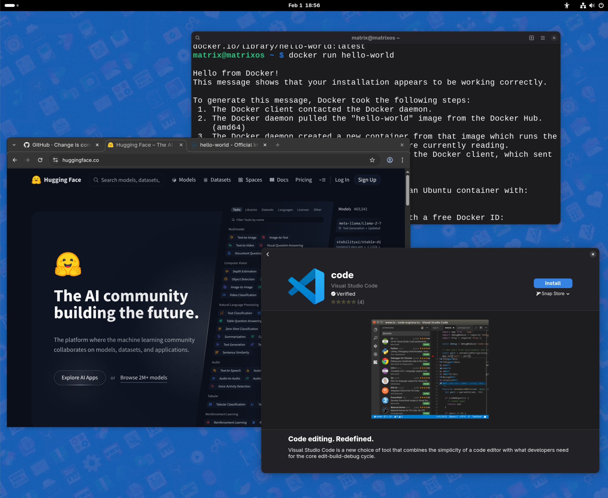
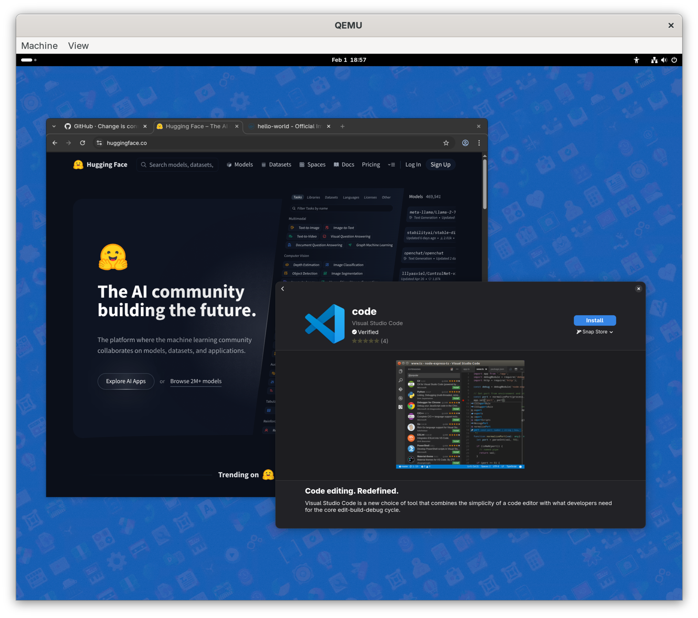

# 👋 Welcome to matrixOS

matrixOS is a Gentoo-based Linux distribution that blends the power and customizability of Gentoo with the reliability of OSTree atomic upgrades. It leverages OSTree to provide **Atomicity** and **Immutability** guarantees, ensuring that updates are applied entirely or not at all, and the base system remains read-only to prevent accidental damage.

It comes with Flatpak, Snap, and Docker ready to go out of the box.

Our two main goals are:

- **Reliability**: Providing a stable, immutable base system through OSTree, which allows for atomic upgrades and rollbacks.
- **Gaming-Friendly**: Shipping with the Steam loader, Lutris, and optimizations to get you gaming on both NVIDIA and AMD GPUs with minimal fuss.

...and our motto is: `emerge once, deploy everywhere`.

TL;DR: Download from: [Cloudflare](https://images.matrixos.org)

## Table of Contents

- [Disambiguation](#️-disambiguation)
- [Disclaimer](#️-disclaimer)
- [Features](#-features)
- [Prerequisites](#-prerequisites)
- [Available Desktops](#️-available-desktops)
- [Available Images & Keys](#-available-images--keys)
- [Installation](#-installation)
- [System Management](#️-system-management)
- [Build Your Own Distro](#️-build-your-own-distro)
- [Known Issues](#️-known-issues)
- [Roadmap Milestones](#-roadmap-milestones)
- [Contributing](#-contributing)
- [License](#-license)

<table align="center">
  <tr>
    <td align="center">
      <a href="./screenshots/1.png">
        
      </a>
      <br />
      <sub>GNOME Desktop w/Steam and GNOME Software</sub>
    </td>
    <td align="center">
      <a href="./screenshots/2.png">
        
      </a>
      <br />
      <sub>System/OS and Flatpak integration</sub>
    </td>
  </tr>
  <tr>
    <td align="center">
      <a href="./screenshots/3.png">
        
      </a>
      <br />
      <sub>OSTree integration</sub>
    </td>
    <td align="center">
      <a href="./screenshots/4.png">
        
      </a>
      <br />
      <sub>Coding and AI</sub>
    </td>
  </tr>
  <tr>
    <td align="center" colspan="2">
      <a href="./screenshots/5.png">
        
      </a>
    </td>
  </tr>
</table>

## 🛠️ Disambiguation

- [The OG matrixOS](https://matrixos.ca): A Debian-based distribution shipping with Trinity Desktop.
- [MatrixOS](https://github.com/203-Systems/MatrixOS): An Operating System for Software Defined Controllers.

We need more entropy in this world!

## ⚠️ Disclaimer

matrixOS is a hobby project created for homelab setups. It is **not** intended for mission-critical production environments. Everything in this repository is provided "AS IS" and comes with **NO WARRANTY**.

## ✨ Features

- **Graphics**: Latest Mesa and NVIDIA drivers out of the box.
- **Cooling**: Includes `coolercontrold` and `liquidctl`.
- **Filesystem**: `btrfs` on `/boot` and `/` with zstd compression, auto-resizing on first boot. Includes `ntfsplus` driver.
- **Security**: UEFI SecureBoot support with easy-to-install certificates.
- **Apps**: Steam, Flatpak, Snap, AppImage, and Docker available immediately.

## 💻 Prerequisites

**Hardware Requirements:**

- **Architecture**: x86_64/amd64 with `x86-64-v3` support (AVX, AVX2, BMP1/2, FMA, etc.).
- **Storage**: At least 32GB (64GB recommended) on USB/SSD/NVMe.

## 🖥️ Available Desktops

matrixOS ships the following desktop environments as separate OSTree branches:

| Desktop | Branch example | Notes |
|---------|---------------|-------|
| **GNOME** | `matrixos/amd64/gnome` | Default and most tested. |
| **Cosmic** | `matrixos/amd64/cosmic` | [System76 COSMIC](https://system76.com/cosmic) desktop. |

Switch between desktops with `sudo vector branch switch` and reboot.

## 📦 Available Images & Keys

Images are available in `raw` (for flashing) and `qcow2` (for VM) formats, compressed with `xz`.
**Trusted Source**: [Cloudflare](https://images.matrixos.org)

### Public Keys

Use these keys to verify the authenticity of images and commits:

- **GPG (OSTree, Images)**: `DC474F4CBD1D3260D9CC6D9275DD33E282BE47CE`
- **SecureBoot Fingerprint**: `sha256 Fingerprint=38:02:D7:FC:A7:6F:08:04:9C:7F:D5:D7:AF:9A:24:6C:9B:C2:28:F3:45:99:7B:DF:79:EE:F3:35:0A:81:87:1B`

## 🔧 Installation

### Option 1: Flash to Drive

Download the image (compressed with `xz`) and its `.sha256` file, then flash it to your target drive using `dd` or similar tools.

```shell
sha256sum -c matrixos_amd64_gnome-DATE.img.xz.sha256
xz -d matrixos_amd64_gnome-DATE.img.xz
dd if=matrixos_amd64_gnome-DATE.img of=/dev/sdX bs=4M status=progress conv=fsync
```

There are two default users:

- **root**: password `matrix`
- **matrix** (UID=1000): password `matrix`
- **LUKS password** (if encrypted): `MatrixOS2026Enc`

### Option 2: Install from matrixOS

Once booted into matrixOS (e.g., from a USB stick), you can install it onto another drive using the built-in installer. It partitions your drive, formats it, and copies the running system to the new drive.

> **Warning:** This will wipe the target drive!

```shell
sudo vector flash
```

If you are partitioning manually, **strict adherence** to the following layout is required:

1. **ESP Partition**: Type `ef00` | GUID: `C12A7328-F81F-11D2-BA4B-00A0C93EC93B`
2. **/boot Partition**: Type `ea00` | GUID: `BC13C2FF-59E6-4262-A352-B275FD6F7172`
3. **/ Partition**: Type `8304` | GUID: `4F68BCE3-E8CD-4DB1-96E7-FBCAF984B709`

### Post-Installation Setup

After your first boot, run the setup wizard to configure your system. Run this from a VT or Desktop terminal.

```shell
sudo vector setupOS
```

This will:

- Set the `root` password.
- Set the user password.
- Set the LUKS encryption password (if you used encryption).
- Regenerate SSH host keys for security.

To enable Docker: `systemctl enable --now docker`.

### 🔒 SecureBoot

matrixOS supports SecureBoot. You can set it up in two ways:

1. **UEFI BIOS Enrollment**: Enroll the `matrixos-secureboot-cert.pem` directly into your UEFI BIOS as an **Authorized Signature (db)**. This allows the firmware to trust the matrixOS bootloader and kernel directly.
2. **Shim MOK Enrollment**: Use the provided `matrixos-secureboot-mok.der` file to enroll a **Machine Owner Key (MOK)** via the Shim MOK Manager at first boot. The `shim` itself is signed by Microsoft (2011 and 2023), allowing it to run on most hardware, and it then validates subsequent stages using the MOK.

## ⚙️ System Management

matrixOS uses OSTree for atomic updates. All system commands require `sudo`.

### Vector Command Reference

A quick reference of all user-facing `vector` commands:

| Command | Description |
|---------|-------------|
| `vector upgrade` | Pull and deploy the latest OS update. |
| `vector flash` | Install matrixOS to a block device. |
| `vector setupOS` | First-boot wizard (passwords, LUKS, SSH keys). |
| `vector readwrite` | Temporarily make the OS mutable (until next upgrade). |
| `vector jailbreak` | Permanently convert to a standard mutable Gentoo system. |
| `vector branch show` | Show the currently booted deployment. |
| `vector branch deployment` | Show all local deployments. |
| `vector branch pin <idx>` | Pin a deployment to preserve it. |
| `vector branch unpin <idx>` | Unpin a previously pinned deployment. |
| `vector branch remote` | List remote branches available. |
| `vector branch local` | List local branches. |
| `vector branch switch [ref]` | Switch to a different OS branch. |

### Upgrades

Update to the latest image:

```shell
sudo vector upgrade
```

Useful flags: `--pretend` (preview without applying), `-y` (skip prompts), `--update-bootloader` (update bootloader binaries), `--force` (upgrade even if up to date).

### Rollbacks

If an update fails, simply boot into the previous entry (`ostree:1`). To manage deployments:

```shell
sudo vector branch show         # show the currently booted deployment.
sudo vector branch deployment    # show all local deployments.
sudo vector branch pin 1         # pin deployment 1.
sudo vector branch unpin 1       # unpin deployment 1.
```

### Branch Switching

List available branches and switch between them (e.g., from `gnome` to `cosmic`):

```shell
sudo vector branch remote   # list remote branches available.
sudo vector branch local    # list local branches.
sudo vector branch switch   # interactively switch to a new branch.
reboot
```

### Mutability & Jailbreaking

- **Temporary Mutability**: `sudo vector readwrite` (resets on upgrade). So that you can run `emerge` as much as you like (important: switch to a `*-full` OSTree branch before doing this).
- **Permanent Jailbreak**: matrixOS is immutable by default. However, if you want full control to modify system files, compile custom kernels, or use Portage directly, you can "jailbreak" the system. This converts your immutable OSTree installation into a standard, mutable Gentoo Linux installation.
  - **Warning:** This is a **one-way process**. Once you jailbreak, you cannot go back to automatic OSTree updates. You are responsible for maintaining the system yourself.
  - List available branches: `sudo vector branch remote`
  - Switch to the `-full` branch: `sudo vector branch switch <branch>-full`
  - Run the jailbreak script: `sudo vector jailbreak`

## 🛠️ Build Your Own Distro

You can build custom versions of matrixOS using the provided `dev/build.sh` script. The build process is: **Seeder -> Releaser -> Imager**. Respectively, the directories are: `build` for Seeder, `release` for Releaser, and `image` for Imager.

### Customization Directories

- **`build/seeders/`**: Contains the build layers (`00-bedrock`, `10-server`, `20-gnome`, `21-cosmic`). Each subdirectory has scripts/configs defining packages and settings for that layer.
- **`release/`**: Configuration for the release process.
  - **`hooks/`**: Scripts running at different release stages.
  - **`services/`**: Systemd services to enable/disable/mask.
  - *Note*: `hooks/` and `services/` follow the `OSNAME/ARCH/SEEDER_NAME.{sh,conf}` pattern (e.g., `matrixos/amd64/gnome.sh`) for branch-specific configs.
- **`image/`**: Configuration for the image creation process.
  - **`hooks/`**: Scripts for partition setup, bootloader install, etc.
  - **`image.releases`**: Defines which releases are built into images.

### Configuration Rules

The base configuration is centralized in `conf/matrixos.conf`. Vector client-side tooling
also reads from `conf/client.conf` (e.g. the upgrade command).

- **Project Info**: OS name, architecture, git repositories.
- **Paths**: Directories for logs, downloads, and output artifacts.
- **Keys**: Paths to GPG and SecureBoot keys lead here.
- **Component Settings**: Specific configs for Seeder, Releaser, and Imager.

**Important**: If you fork this repository to customize builds, update `GitRepo` in `conf/matrixos.conf` to point to your fork.

### Build Workflow

Run the build script as root. It handles the entire pipeline.

```shell
./dev/build.sh
```

- **Resume**: `./dev/build.sh --resume`
- **Force specific steps**: `--force-release`, `--force-images`, `--only-images`

### Vector Build Commands

The `vector` CLI also provides direct access to individual build stages:

| Command | Description |
|---------|-------------|
| `vector build seeds` | Run the seeding stage. |
| `vector build release` | Run a single release. |
| `vector build releases` | Run all releases. |
| `vector build image` | Build a single image. |
| `vector build images` | Build all images. |
| `vector dev enter <name>` | Enter a build chroot. |
| `vector dev janitor` | Clean up build artifacts. |
| `vector dev check` | Verify host has required tools/data. |
| `vector dev vm` | Test a generated image with QEMU. |

For a full list of flags on any command, run `vector <command> --help`.

**Resource Requirements**: x86-64-v3 CPU, 32GB+ RAM, ~70GB Disk.

## ⚠️ Known Issues

### GNOME fractional scaling

If GNOME only offers 100% or 200% scaling, enable fractional scaling:

```shell
gsettings set org.gnome.mutter experimental-features "['scale-monitor-framebuffer']"
```

### NVIDIA drivers and nouveau fight

If nouveau loads despite NVIDIA drivers being present:

```shell
ostree admin kargs edit-in-place --append-if-missing=modprobe.blacklist=nouveau
ostree admin kargs edit-in-place --append-if-missing=rd.driver.blacklist=nouveau
```

## 🚀 Roadmap Milestones

The current focus is on **User Friendliness (Milestone 3)** and **New Technologies (Milestone 4)**.

### Milestone 4 (Future)

- [x] Rewrite core tooling in Go (`vector`) — in progress, most user-facing commands migrated.
- [ ] Implement proper CI/CD pipelines and testing.
- [ ] Migrate to `bootc` or wrapper on top of `ostree` + UKI support, moving away from direct `ostree` usage.

## 🙏 Contributing

Contributions are welcome!

- **Code**: helping with the migration to `bootc` or improving CLI tools.
- **Resources**: Mirrors for images/OSTree repo and compute power for builds.
- **Donations**: Please donate to [Gentoo Linux](https://gentoo.org/donate).

## 📄 License

First-party code is released under the **BSD 2-Clause "Simplified" License**. See [LICENSE](LICENSE) for the full text.
Third-party applications retain their respective licenses.
